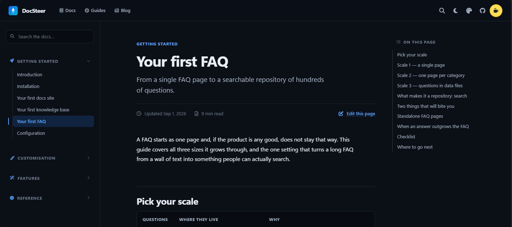

# DocSteer

**Simple, searchable docs and knowledge bases for teams** — a fast,
framework-free Jekyll theme for technical documentation, help centres and
internal wikis.

[**Live demo**](https://Skyflash.github.io/docsteer) ·
[Documentation](https://Skyflash.github.io/docsteer/docs/introduction/) ·
MIT licensed



---

## Features

| | |
| --- | --- |
| 🎨 **6 colour skins** | `aqua`, `violet`, `mint`, `ember`, `graphite`, `clay` — each with light **and** dark, switchable in `_config.yml` or live in the navbar |
| 🌗 **Dark mode** | Follows the OS, or a manual toggle stored in `localStorage`, no flash on load |
| 🔍 **Live search** | Prebuilt JSON index + keyboard-driven modal (`/`, <kbd>⌘K</kbd>), zero dependencies |
| 🖼️ **Image lightbox** | Click-to-zoom, galleries, captions, keyboard nav |
| 📑 **Auto TOC** | Built from your headings, with scroll-spy |
| ❓ **FAQ pages** | `layout: faq` — accordion built on native `<details>`, deep-linkable questions, indexed by the search, `FAQPage` structured data |
| 📱 **Responsive & pixel-perfect** | 320 px phones → ultrawide, real mobile drawer |
| ⚡ **Fast** | ~7 kB vanilla JS (all deferred), compressed CSS, `preconnect`/`preload` |
| 🔎 **SEO ready** | `jekyll-seo-tag`, sitemap, RSS, Open Graph, JSON-LD |
| ✏️ **Easy to customise** | All colours in one Sass map, documented CSS tokens, upgrade-safe override files |
| 🧩 **Font Awesome** | 6.5.2 Free, **bundled locally** by default (offline / firewall-safe); CDN optional |
| ☕ **Buy me a coffee** | Optional support button (navbar / sidebar / footer) |

## Quick start

```bash
git clone https://github.com/Skyflash/docsteer.git
cd docsteer
bundle install
bundle exec jekyll serve --livereload
# → http://localhost:4000
```

Then:

1. Edit **`_config.yml`** — everything is under the `docsteer:` key.
2. Pick a skin: `docsteer: { skin: violet }`.
3. Add pages to **`_docs/`** and list them in **`_data/navigation.yml`**.

Full guide: [`/docs/introduction/`](https://Skyflash.github.io/docsteer/docs/introduction/).

## Project layout

```
_config.yml              All theme options (docsteer: key)
_data/navigation.yml     Top nav + grouped sidebar
_layouts/                default · home · doc · page
_includes/               header, sidebar, footer, search modal, TOC (overridable)
_includes/head-custom.html   ← your meta/fonts; never overwritten by upgrades
_sass/docsteer/         one partial per concern
_sass/docsteer/_skins.scss   ← all six palettes live here
assets/js/               main.js · search.js · lightbox.js  (independent)
assets/css/main.scss     entry point
search.json              search index (Liquid-generated)
_docs/                   the theme's own documentation (sample content)
```

## Configuration

See [`_docs/configuration.md`](_docs/configuration.md) or the rendered
[Configuration page](https://Skyflash.github.io/docsteer/docs/configuration/).
Highlights:

```yaml
docsteer:
  skin: aqua              # aqua | violet | mint | ember | graphite | clay
  mode: auto              # auto | light | dark
  search:  { enabled: true, collections: [docs], hotkey: true }
  lightbox: { enabled: true }
  toc:     { enabled: true, min_headings: 2 }
  buy_me_a_coffee: { username: "cristiancastellari", show_in: [navbar, footer] }
  footer:  { show_credit: true }
```

## Deploying

GitHub Pages (via Actions), Netlify, Vercel, Cloudflare Pages — see
[`_docs/deploying.md`](_docs/deploying.md). Build command
`bundle exec jekyll build`, publish `_site/`.

## Customising

- **Colours** — edit the map in `_sass/docsteer/_skins.scss`; every value
  becomes a CSS custom property.
- **Sizing / fonts** — `_sass/docsteer/_tokens.scss`.
- **Head tags** — `_includes/head-custom.html` (kept empty so upgrades are safe).
- **Add a skin** — map entry + navbar list entry + `.skin-dot--name` gradient.

## License

[MIT](LICENSE). Attribution appreciated, not required
(`footer.show_credit: false` to remove it).
Font Awesome is under its own [Free License](https://fontawesome.com/license/free).

## Roadmap

Planned work, deferred decisions and the release checklist live in
[`ROADMAP.md`](ROADMAP.md). Released changes are in
[`CHANGELOG.md`](CHANGELOG.md).

## Support

If DocSteer saved you time, you can
[**buy me a coffee** ☕](https://www.buymeacoffee.com/cristiancastellari). Bug reports and
PRs welcome in [Issues](https://github.com/Skyflash/docsteer/issues).
